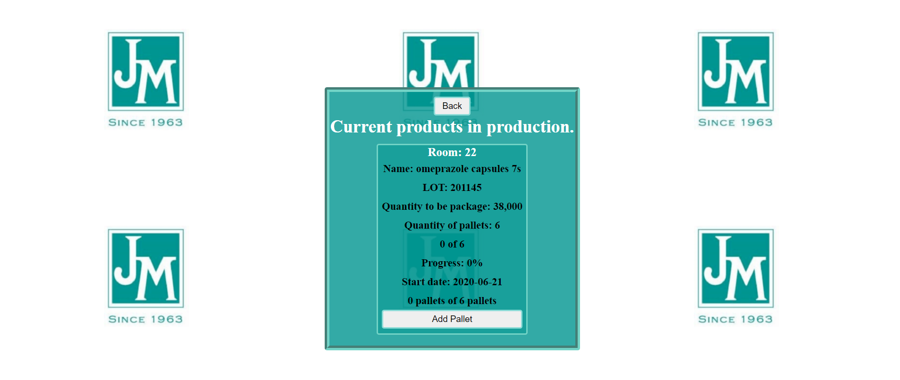
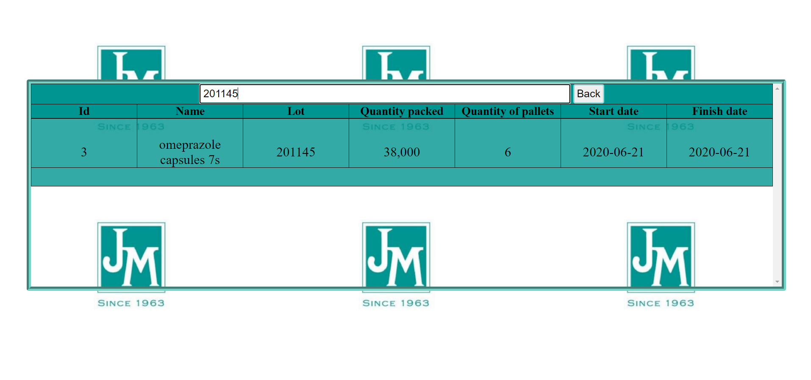

# JM
 *A small web page that allows the person in charge of the packaging section manage the different rooms.*

       
## Features 

* <strong>Register product</strong>: Register new product for packing, it has a simple filter that shows the registered products while typing, if there's no product with that name it doesn't show anything.
 
***

* <strong> Start packing </strong>: Select the room to start packing the product <strong>(22,34,139,158)</strong>, if the room isn't busy it will allows him to procedure, if it isn't, it wont allow him.</strong>

***

* <strong> See actual products </strong>: See the actual products in production, as the quantity of pallets increases it will increase the progress production. 

***
Once finished the packing of the product, it will allows to clear the room and start packing a new one.

***
* <strong>Finished products </strong>: It shows a tablet with the finished products ordered by id.

***
Also can search on it throught **name, lot, quantity, date**, this table will show a maximun of 5 finished products, if there's less than 5 in the data base table it won't show **See more**, it will show **No more results.**
***

and that's all, this is my first "small - serious" project that I made by myself, I did it thinking in my actual job enviorenment, they always entering to the rooms seeing how is going the process, and I though why instead of walk to the room, not see it throught localhost?
